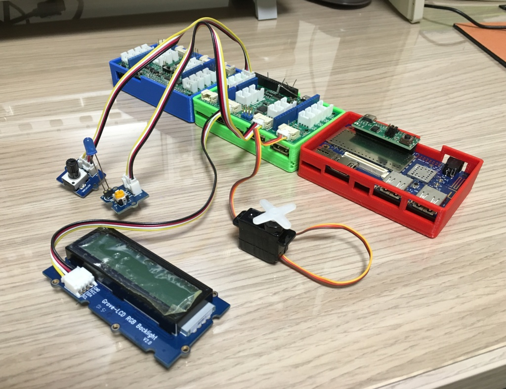
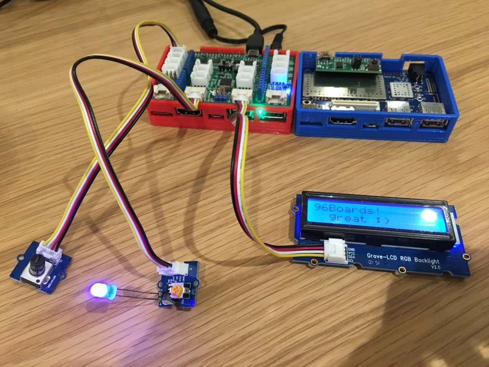
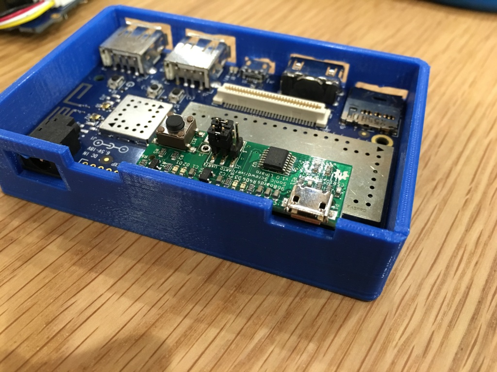
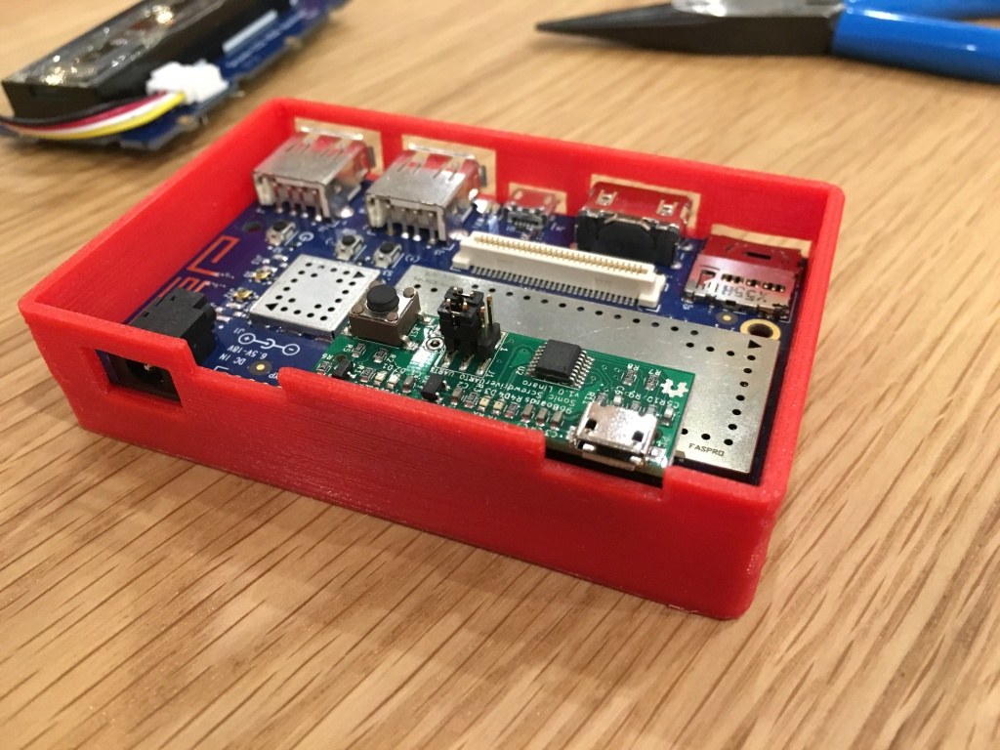
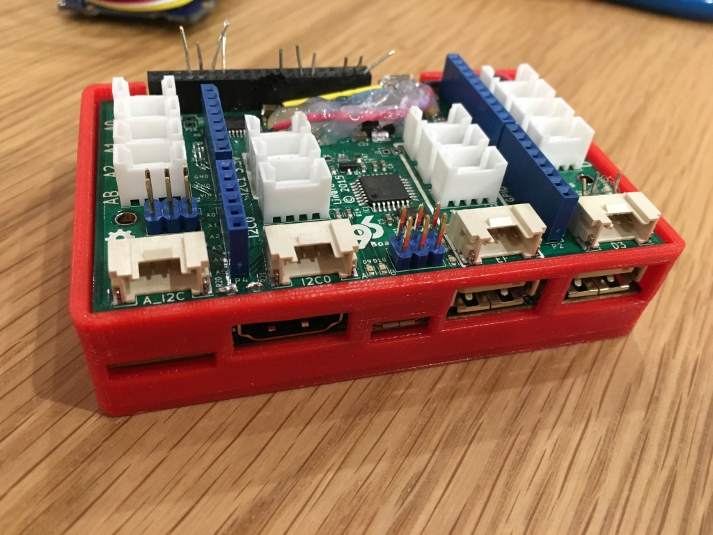
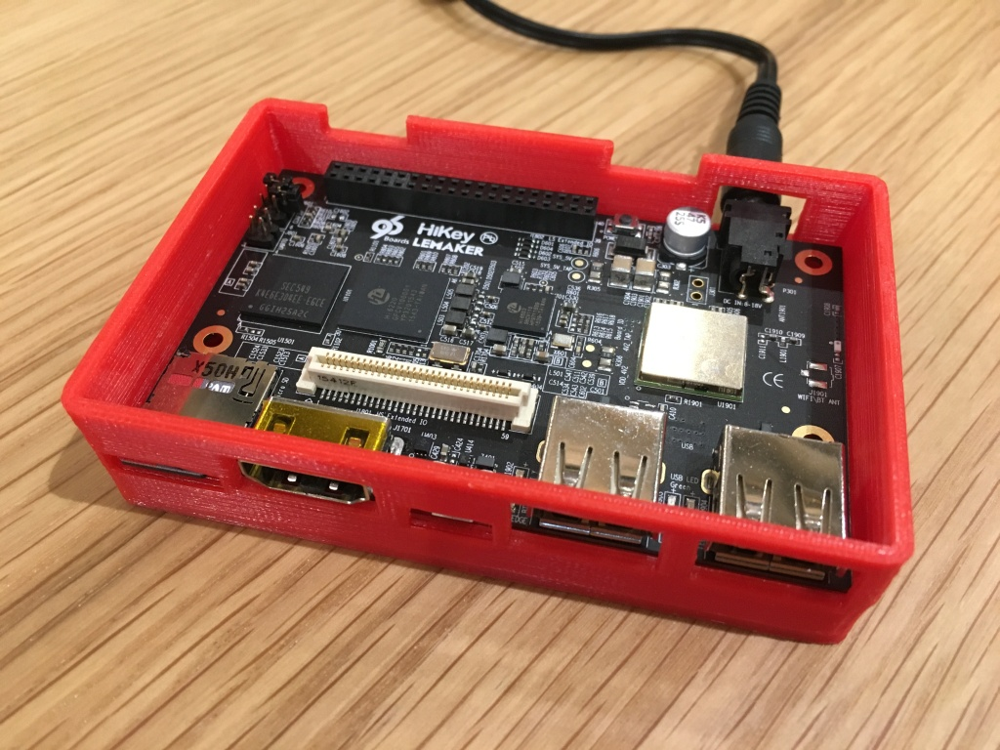

# 96boards-case

Files for making cases for 96Boards CE with 3D printers.

## File list

Open scad file, fits 96Boards CE

	96board-case.scad

STL file, fits 96Boards CE

	96board-case.stl

Open scad file, fits 96Boards CE with Mezzanine board

	96board-ce-mezzanine.scad

STL file, fits 96Boards CE with Mezzanine board

	96board-ce-mezzanine.stl

gcode file exported from stl file, fits 96Boards CE with Mezzanine board

Used for MUTOH MF-2000

	96board-ce-mezzanine.gcode

x3g file exported from stl file, fits 96Boards CE with Mezzanine board

Used for MakerBot Replicator 2X

	96board-ce-mezzanine.x3g

## Images

